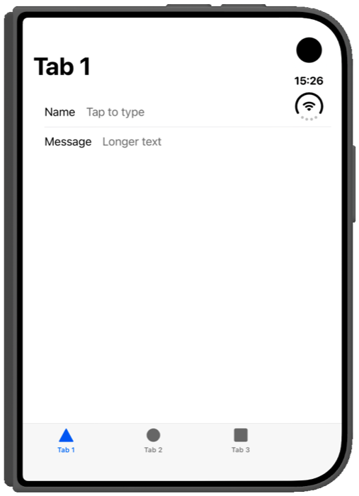
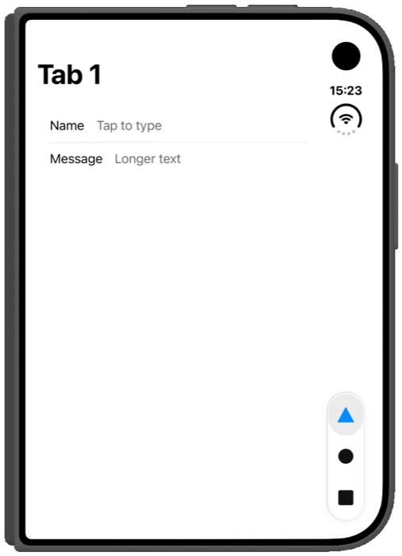
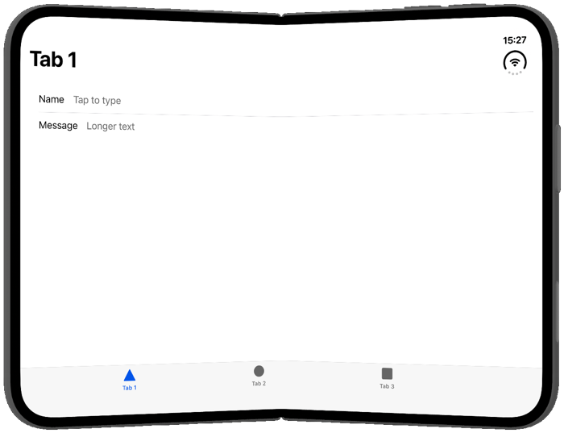
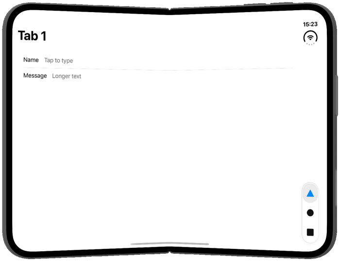
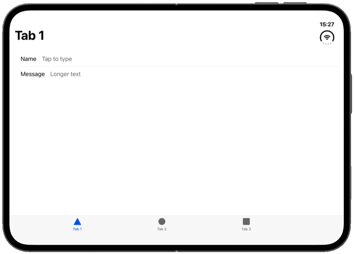
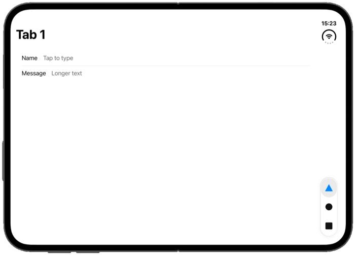
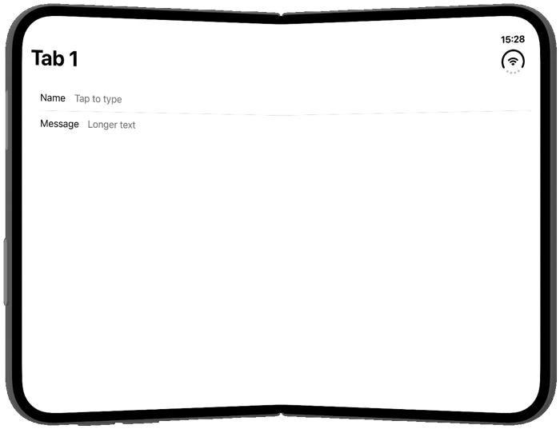
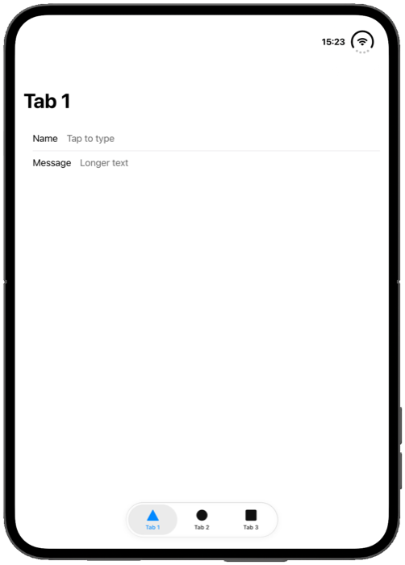

# iPhone Duo

iPhone Duo support uses the iOS 27.1 APIs. It turns on when the app uses Capacitor 8.5 or later, is built with Xcode 27.1 or later and runs on iOS 27.1 or later. Apps built with an older Xcode keep working and report no fold. Capacitor 7 apps must stay on Xcode 26: iOS 27 requires the scene lifecycle, which only Capacitor 8.5 and later adopt, so a Capacitor 7 app built with Xcode 27 crashes at launch.

- `getFoldState()` and `window.viewport.segments` come from the fold's reserved region. The fold is a 40-point band in the middle of the inner display: split around it while half-open, one segment while fully open.
- Half-open and fully open follow the hinge status, so `foldStateChange` fires as soon as the hinge moves.
- `getHingeAngle()` and `hingeAngleChange` come from the hinge. UIKit reports the angle in radians, and the plugin converts it to degrees to match Android: 0 closed, 180 fully open.
- `activeDisplay` (inner or outer) comes from the hinge status, and `cameraBounds` from the camera reserved regions.
- **Bar placement.** On iPhone Duo, native tab bars and toolbars move to the side of the display, but HTML tab bars stay where they are. `getBarPlacement()` reports `{ verticalBarEdge: 'leading' | 'trailing' | null }`, with a `barPlacementChange` event and a `vertical-bars-leading` / `vertical-bars-trailing` class on `<html>`, so your tab bar can move to the side too. It reports `null` on Android.

## What the plugin reports

Measured in the iPhone Duo simulator from Xcode 27.1 beta:

| Pose | `state` · `posture` | Window | Size class | Hinge | Bars |
| --- | --- | --- | --- | --- | --- |
| Closed | flat · flat, outer display | 466 × 678 (678 × 466 sideways) | compact width | 0° | vertical, on the side away from the camera |
| Fully open | flat · flat | 951 × 669 (669 × 951 upright) | regular | 180° | vertical in landscape, horizontal upright |
| Half-open, held sideways | half-opened · book | 951 × 669, split 456 \| 455 | regular | about 128° | vertical |
| Half-open, held upright | half-opened · tabletop | 669 × 951, split 456 over 455 | regular | about 128° | horizontal |

## How much of the screen your app gets

iPhone Duo treats an app by the SDK it was built with: apps older than iOS 27 run in a compatibility mode inside a black border, apps built with iOS 27.0 fill more of the inner display but still leave gaps, and apps built with the iOS 27.1 SDK get the whole display. So `npx cap sync ios` with Xcode 27.1 matters as much as the code in this plugin.

Apple also requires every app and game uploaded to App Store Connect from [April 2027](https://developer.apple.com/news/?id=k1mtkt1k) to be built with the iOS 27 SDK or later, so every app meets the second tier by then whether or not it adapts to the fold.

## Keep bars horizontal

When iPhone Duo moves bars to the side, the status bar turns vertical too, and the system adds a leading or trailing safe-area inset for it. If your app has an HTML tab bar at the bottom and you would rather keep everything horizontal, opt out:

1. In `ios/App/App/SceneDelegate.swift`, use the view controller the plugin ships:

   ```swift
   import Capacitor
   import FoldablePlugin

   window?.rootViewController = FoldableBridgeViewController()
   ```

   Older Capacitor apps create the controller in `Main.storyboard` instead. There, set the class to `FoldableBridgeViewController` with module `FoldablePlugin`.

2. Then choose the behaviour from JavaScript, at any time:

   ```typescript
   await Foldable.setVerticalBarBehavior({ behavior: 'disabled' });  // everything stays horizontal
   await Foldable.setVerticalBarBehavior({ behavior: 'automatic' }); // back to the system default
   ```

It resolves to `{ applied: false }` when the app does not use `FoldableBridgeViewController`, so you can tell the setup is missing. Android, web and iOS before 27.1 always answer `false`.

To move your tab bar to the side instead, like native apps, see [Ionic tabs](#ionic-tabs).

## Reading the regions yourself

`getReservedRegions()` returns everything the system reserves on the current display, which on iPhone Duo is the fold, the strip for the vertical status bar and the under-display camera:

```typescript
const { regions } = await Foldable.getReservedRegions();
// [
//   { kind: 'division', x: 456, y: 0, width: 40, height: 669,
//     margins: { top: 0, right: 20, bottom: 0, left: 20 }, isActive: true },
//   { kind: 'occlusion', x: 677, y: 21, width: 58, height: 37, isActive: false },
//   { kind: 'occlusion', x: 867, y: 0, width: 84, height: 120, isActive: true },
// ]
```

- The fold's frame is the crease **plus** the margins the system wants kept clear, 20 points each side on iPhone Duo. `getFoldState()` reports the same margins as `hingeMargins`, and the polyfill sets them as `--fold-margin-*`.
- An inactive division means the phone is flat: the fold is still there, and its position is still useful for lining a layout up with the crease. The plugin always includes inactive regions, so the fold is reported whatever the phone is doing.
- An inactive occlusion is a camera that is not in use.
- `getHingeAngle()` also reports the system's `status` (`closed`, `partiallyOpen`, `fullyOpen`). It can lag the angle, so the plugin trusts the angle when they disagree.

### Straight from UIKit

Writing native code beside the plugin, in a bridge view controller subclass or in SwiftUI, the same regions come from `UIView`:

```swift
let regions = view.reservedRegions(kind: .division, options: .includeInactive)
```

`options: .includeInactive` is the part that catches people out. A flat iPhone Duo still has a fold, but the system marks that region inactive, so a plain `reservedRegions(kind: .division)` returns an empty array until the phone is folded. The same is true of the under-display camera, which is only active while the camera is in use.

## Ionic tabs

On iPhone Duo, native tab bars move to the side of the display as a small floating pill under the clock. Ionic's `ion-tabs` is HTML, so it stays a full-width bar at the bottom, next to a status bar that has already moved to the side:

| Without the plugin | With `ionic-tabs.css` |
| --- | --- |
|  |  |
|  |  |
|  |  |

The plugin ships a stylesheet that turns `ion-tabs` into that pill wherever iPhone Duo puts bars on the side:

```typescript
import '@erkamyaman/capacitor-foldable/ionic-tabs.css';
import { installFoldablePolyfill } from '@erkamyaman/capacitor-foldable';

await installFoldablePolyfill({ ionicKeyboard: true });
```

Angular rejects a CSS import in a TypeScript file, so put the stylesheet in `src/global.scss` instead:

```scss
@use '@erkamyaman/capacitor-foldable/ionic-tabs.css';
```

- The pill follows the side the system uses (it switches with the camera as you rotate), and moves up to clear the camera when the camera is below it. `installFoldablePolyfill()` sets the `vertical-bars-*` classes and the `--vertical-tab-bar-bottom` variable it needs.
- Everything in it is scoped to those classes, so it changes nothing on other iPhones, iPads, Android or the web, or on iPhone Duo held open and upright.
- It's plain CSS, so you can override any of it, such as the colors of the selected tab.

### The disappearing tab bar



Without the plugin, Ionic apps on iPhone Duo can lose their tab bar entirely, as above. Two things cause it:

- iPhone Duo sends a "keyboard will show" event on every fold, with no text field focused. Ionic hides the tab bar while the keyboard is open, so folding hides it.
- When the keyboard closes, Ionic waits for the window to return to the height it had when the keyboard first opened. Type on the outer display (678 pt tall), then close the keyboard on the inner display (669 pt tall), and that never happens, so the tab bar stays hidden until you fold back.

`ionicKeyboard: true` takes over from Ionic: keyboard events no longer reach it, and the plugin sets a `foldable-keyboard-open` class on `<html>` only while a text field really has the keyboard. `ionic-tabs.css` hides the tab bar with that class. It's off by default because it changes which listeners see the keyboard events: the Keyboard plugin's own `Keyboard.addListener` still gets them, but window listeners added after the plugin's don't.

### iOS 26 tab bar



With the inner display upright, iPhone Duo keeps a horizontal tab bar: iOS 26's floating Liquid Glass pill. Ionic still draws the older full-width bar. To match iOS 26 there too, and on every other iPhone, add:

```typescript
import '@erkamyaman/capacitor-foldable/ionic-tabs-ios26.css';
```

This one changes every iPhone running your app, which is why it's a separate file.

## Test on the iPhone Duo simulator

1. Install Xcode 27.1 or later, then open **Settings → Components** and download the **iOS 27.1** simulator. The iOS 27.2 beta simulator doesn't run iPhone Duo.
2. Build your app with that Xcode and run it on an **iPhone Duo** simulator.
3. Xcode 27 replaces the Simulator app with **DeviceHub**. Its controls open, close, half-fold and rotate the phone.
4. The phone starts closed, so the app appears on the outer display. From a terminal, `xcrun simctl io <device> screenshot --display=1` captures the outer display and `--display=3` the inner one.

Without the simulator, a browser's responsive mode at the outer display's 466 × 678 and the inner display's 951 × 669 gets you most of the way. Apple's published inner display size, 626 × 890, is smaller than what the simulator reports, so check both.
